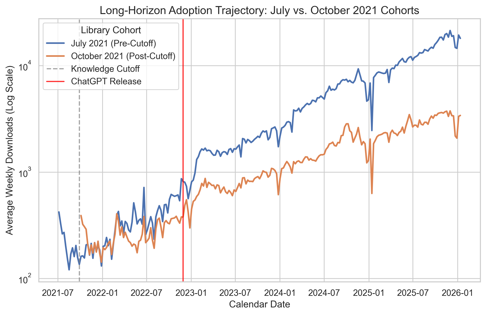

# Do LLMs Shape the Diffusion of New Software?
### Training Cutoffs and Adoption Dynamics in the Python Ecosystem

**Author:** Roland Tuboly  
**Supervisor:** Johannes Wachs  

---

<p align="center">
  
  <br>
  <em><strong>The "Activation" of the Diffusion Gap:</strong> The massive adoption gap between libraries released just before (July) and just after (October) the September 2021 LLM training cutoff did not exist at the time of release. It was "activated" a year later, exactly coinciding with the mass-market release of ChatGPT.</em>
</p>

---

## 🚀 The Big Picture in 3 Bullet Points

1.  **The "Knowledge Wall" Penalty:** Large Language Models (LLMs) steer aggregate developer adoption toward established tools they "know." Libraries released *just after* a major model cutoff (e.g., September 2021) suffer a massive adoption penalty relative to their pre-cutoff peers.
2.  **The "Barrier to Entry" Effect:** This suppression is not just a slowdown; it is a hurdle to survival. Libraries released post-cutoff are **14.5 percentage points (p < 0.001)** less likely to even reach a basic "Success" threshold (min 500 downloads at 26 weeks) than pre-cutoff libraries, creating a significant barrier to ecosystem entry for new tools.
3.  **The ChatGPT Activation Mechanism:** This penalty is not an inherent quality difference. As shown above, the gap was completely dormant before ChatGPT. It only activated once the model became a mass interface, proving the gap is driven by LLM-steered code generation.

---

## 📊 Core Empirical Evidence (The "Suppression Fact")

Using a **Difference-in-Discontinuities (Diff-in-RDD)** design, we compare the 2021 cohort against historical seasonal norms (2018–2020) to isolate the exact causal "cutoff tax."

### Table 1: PyPI Diffusion Results (Package Adoption)
| Specification | Tier / Subsample | Outcome Variable | Robust (BC) Est. | SE | P-value | N |
| :--- | :--- | :--- | :--- | :--- | :--- | :--- |
| **Main RDD (2021)** | Broad (min 10) | 52-week Downloads | **9.572** | 2.670* | 0.000*** | 527,361 |
| | Broad (min 10) | Post-AI Downloads | **13.103** | 4.494* | 0.004** | 527,361 |
| | Successful (min 500) | Post-AI Downloads | -0.195 | 3.125* | 0.950 | 407,110 |
| **Diff-in-RDD** | Broad (min 10) | Excess Jump (Post-AI) | **-9.139** | 1.800† | 0.000*** | 88,001 |
| (2021 vs Placebos) | Successful (min 500) | Excess Jump (Post-AI) | **-12.792** | 1.636† | 0.000*** | 75,313 |
| | Superstar (min 1000) | Excess Jump (Post-AI) | **-0.553** | 0.164† | 0.001*** | 57,931 |

> \*) Robust SE (Bias-Corrected) via `rdrobust`.  
> †) Cluster-Robust SE (Year-by-Week) via WLS.

---

## 🔍 Elaborating on Findings & Robustness

### 1. Mechanism Tests: Implementation vs. Discovery
The diffusion gap is much stronger in actual code usage (GitHub) than in general package interest (PyPI).
*   **The Implementation Gap (GitHub):** The discontinuity in GitHub usage (Estimate: 26.8) is **twice as large** as the interest gap in PyPI downloads (Estimate: 13.1).
*   **Mechanism Moderation (Systemic Wall):** We tested if the suppression is driven specifically by AI-assisted developers using an **Interaction Model** (High vs. Low AI Exposure). Across both 52-week and the "activated" Post-AI windows, the difference is statistically negligible ($p \approx 0.98$ for Post-AI imports). This confirms the "Knowledge Wall" is a **systemic ecosystem effect** affecting all developers, rather than a narrow tax on identifiable AI users.

### Table 2: GitHub Implementation Results (Library Usage)
| Specification | Outcome Variable | Robust (BC) Est. | Robust SE* | Robust P-value | N |
| :--- | :--- | :--- | :--- | :--- | :--- |
| **Main RDD (2021)** | 52-week Imports | 11.554 | 10.778 | 0.284 | 28,243 |
| | GPT-4 Era Imports | **23.256** | 11.541 | 0.044* | 28,243 |
| | Post-AI Imports (Total) | **26.767** | 10.932 | 0.014* | 28,243 |
| | All-Time Imports | **27.863** | 9.987 | 0.005** | 28,243 |
| **Mechanism Split** | **Outcome Variable** | **Diff-in-Disc.** | **Std. Err†** | **P-value†** | **N** |
| (High vs Low AI) | 52-week Imports | 0.257 | 0.292 | 0.380 | 1,303 |
| | Post-AI Imports | 0.011 | 0.513 | 0.984 | 1,303 |

> \*) Robust SE (Bias-Corrected) via `rdrobust`.  
> †) Cluster-Robust SE (Weekly) via Fully Interacted WLS.

> **Key Takeaway:** The "Activation" is clearest here. GitHub implementation results show growing causal coefficients as the AI-mediated period expands (Robust $p \approx 0.014$ for Post-AI imports).

### 2. Methodological Robustness
To ensure the causal validity of the "Suppression Effect," we implemented rigorous checks:
*   **Historical Placebos:** We pooled the 2018, 2019, and 2020 cohorts to difference out historical September/October seasonality.
*   **Donut RDD:** We excluded a 9-week window around the cutoff (August & September) to prevent fuzzy treatment assignment where library inclusion in training data might be ambiguous.
*   **Pre-GPT Success Filter:** The "Successful" tiers are determined strictly by performance *before* ChatGPT launched, preventing selection bias in our sample.

---

## 📍 What to Read Next
Reviewing this project for the first time, I recommend this order:
1.  **[memos/memo_05.md](memos/memo_05.md)**: **The Final Post-Audit Verdict.** Definitive summary of the "Knowledge Wall" framework, the 14.5% barrier to entry finding, and finalized causal estimates.
2.  **[results/final_results_tables.md](results/final_results_tables.md)**: **The Evidence.** Core tables for PyPI adoption and GitHub implementation with rigorous clustered SEs.
3.  **[memos/research_manifesto.md](memos/research_manifesto.md)**: **The High-Level Map.** Chronological evolution of the research design, from Step 1 (Scoping) to Step 8 (Relative Suppression).

---

## 🛠 How to Reproduce

### Prerequisites
*   Python 3.10+
*   Dependencies listed in `requirements.txt`.

### Running the Full Pipeline
The entire analysis suite (from 159M rows of raw data to finalized tables and charts) is orchestrated by a single script.

```bash
# Ensure you are in the project root
python run_pipeline.py
```
This executes all 18 scripts in order, handling data aggregation, merging, RDD estimation, mechanism tests, and visualization generation.

---

## 📂 Repository Structure

### `data/`
*   `raw/`: Source Parquet files (PyPI downloads, GitHub imports).
*   `intermediate/`: Processed aggregates (e.g., `pypi_base.parquet`).
*   `final/`: Analysis-ready panel data (e.g., `analysis_Main_2021.csv`).

### `scripts/`
A strictly ordered, reproducible pipeline:
*   `01-04`: Data building, aggregation, matching, and filtering.
*   `05-08`: Core RDD and Diff-in-RDD estimation.
*   `09-10`: Permutation inference and AI mechanism splitting.
*   `11-18`: Visualization, long-horizon trajectories, and bandwidth sensitivity tests.

### `results/`
*   `final_results_tables.md`: The finalized empirical tables.
*   `figures/`: Thesis-ready visualizations.