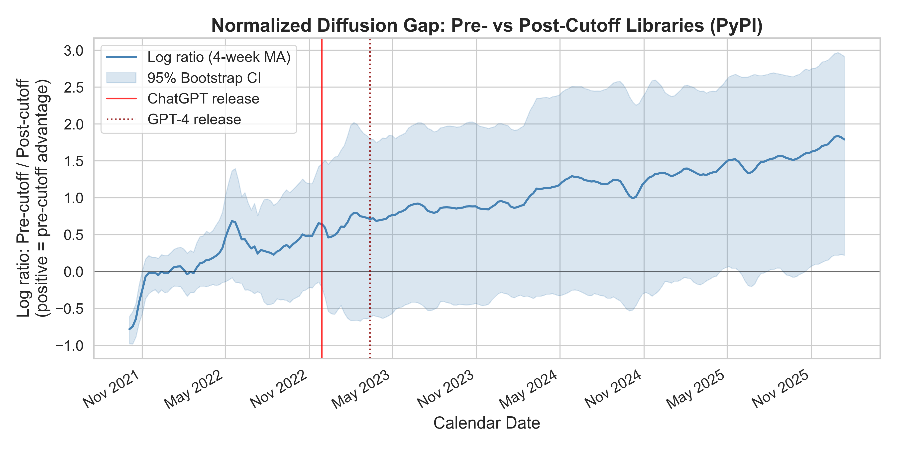

# Do LLMs Shape the Diffusion of New Software?

### Training Cutoffs and Adoption Dynamics in the Python Ecosystem

**Author:** Roland Tuboly | **Supervisor:** Johannes Wachs

**Institution:** Corvinus University of Budapest, MSc in Social Data Science

**Award:** 1st place, Corvinus University TDK (Scientific Students' Associations Conference), 2026. Nominated for OTDK (national round).

**Full paper:** [`thesis.pdf`](thesis.pdf)

---

<p align="center">
  
  <br>
  <em>Log ratio of pre- vs post-cutoff cumulative PyPI downloads (positive = pre-cutoff advantage), with 95% bootstrap confidence interval. The gap is absent at release and emerges only after ChatGPT launches (November 2022), then widens persistently through early 2026.</em>
</p>

---

## Summary

This paper investigates whether large language models with dated training cutoffs shape the diffusion of newly released Python libraries. The research design is a Regression Discontinuity Design around the September 2021 GPT-3.5/GPT-4 training cutoff, combined with a Difference-in-Discontinuities specification that uses 2018-2020 placebo cohorts to net out seasonal release patterns.

The main finding is that the diffusion gap between pre- and post-cutoff libraries is absent at release, emerges only after ChatGPT launches in November 2022, and persists through January 2026 in the arithmetic-mean cohort comparison. Before ChatGPT, the post-cutoff cohort is in fact ~30 percentage points *more* likely to reach the Successful tier, a probability outcome that is robust to specification choices and that makes the post-launch suppression direction conservative. After ChatGPT, the Diff-in-RDD discontinuity is significant in the baseline-adjusted specification; its magnitude is small and sensitive to spike-week treatment, with the direction preserved (see Caveats).

## Key Results

- **Pre-AI covariate balance:** +30 pp higher probability of Successful tier for the post-cutoff cohort before ChatGPT, p < 0.001, N ≈ 529k. Robust across specifications.
- **Diff-in-RDD suppression (post-ChatGPT):** statistically significant in the baseline-adjusted spec for Successful libraries (β = −0.65 log points, p = 0.019, N = 66,714 after excluding three contaminated placebo weeks; see Caveats). Year-by-week clustered standard errors.
- **Activation pattern:** the gap is absent at release and emerges only after ChatGPT (November 2022).
- **Implementation gap (suggestive):** the thesis-reported headline ordering shows a larger discontinuity in GitHub code imports than in PyPI downloads; under the conventional `rdrobust` specification, the GitHub estimate preserves sign but is no longer significant (β = +1.46, p ≈ 0.30). See Caveats.
- **Persistence:** no catch-up through January 2026 in the arithmetic-mean cohort comparison.
- **AI exposure moderation (exploratory):** not statistically significant (p = 0.179, N = 1,303); likely underpowered, and the moderator is measured post-treatment.

## Data Sources

PyPI weekly per-package download counts from the Google BigQuery public dataset (527,361 packages in window) and a GitHub library-week panel of public repository code imports with a per-commit AI-scoring layer (28,243 matched libraries). The two are joined by PEP 503-lite normalized package name. Raw inputs in `data/raw/` are not tracked; the construction pipeline is in `scripts/pipeline/` (steps 01-03).

## Repository Structure

```
thesis/
├── thesis.pdf                  # Compiled paper (read this)
├── thesis.tex                  # LaTeX source
├── references.bib              # Bibliography (natbib)
├── scripts/
│   ├── pipeline/               # Data construction (01-03)
│   ├── main/                   # Core results in paper body (04-05, 08, 10-11, 14-17, 19)
│   ├── appendix/               # Robustness, sensitivity checks, post-submission audit (06-07, 09, 12-13, 15-19)
│   ├── config.py               # Shared constants
│   └── utils.py                # Shared helpers
├── data/
│   ├── raw/                    # Source parquet files (not tracked)
│   ├── intermediate/           # Processed aggregates (not tracked)
│   └── final/                  # Analysis-ready CSVs per cohort (not tracked)
├── results/
│   ├── final_results_tables.md # Definitive empirical tables (top-level index)
│   ├── main/                   # Diff-in-RDD, RDD, covariate balance, density test
│   ├── audit/                  # Post-submission matched-sample audit
│   ├── robustness/             # Bandwidth, permutation, stacked, multi-cutoff
│   ├── descriptive/            # Weekly ratios and percentage summaries
│   ├── mechanism/              # AI-exposure exploratory split
│   └── figures/
│       ├── main/               # Paper-body figures
│       ├── diagnostic/         # Pre-treatment design checks
│       ├── robustness/         # Sensitivity panels
│       ├── audit/              # Post-submission audit visuals
│       ├── appendix/           # Common-origin trajectory etc.
│       └── mechanism/          # Exploratory mechanism diagnostics
├── TDK_presentation.pptx       # Defense slide deck (May 2026)
├── run_pipeline.py             # Orchestrates all scripts (--skip-pipeline, --appendix)
└── requirements.txt
```

## Reproduction

```bash
make install      # pip install -r requirements.txt
make figures      # rebuild every figure and table from processed data
make audit        # rerun the post-submission audit scripts
make thesis       # compile thesis.pdf via latexmk
```

Equivalent direct calls (`python run_pipeline.py --skip-pipeline`, `python run_pipeline.py --appendix`, etc.) are listed in the `Makefile`. Requires access to the source data files in `data/raw/` (not tracked); scripts `14`, `16`, and `19` in `scripts/main/` load the full raw PyPI parquet and require >8 GB of RAM.

The pinned versions in `requirements.txt` reflect the exact environment used to produce the results in this repository (Python 3.14, pandas 3.x, numpy 2.x, statsmodels 0.14, rdrobust 1.3). Older Python environments will require relaxing the pins; the analysis itself only relies on standard pandas, numpy, statsmodels, and rdrobust APIs.

## Caveats and post-submission audit

A post-submission audit (May 2026) found that two of the reported magnitudes are sensitive to specification choices: (i) three contaminated placebo weeks load the Diff-in-RDD against the post-cutoff cohort, and (ii) the headline `rdrobust` point estimates are bias-corrected rather than conventional. The direction of the baseline-adjusted Diff-in-RDD is preserved under both corrections, but the magnitudes collapse. The +30 pp pre-AI covariate balance result, the activation pattern, and the AI-exposure null are all unaffected. The audit script is `scripts/appendix/19_audit_github_diff_in_rdd.py`; the audit output is `results/audit/audit_matched_diff_in_rdd.csv`.
